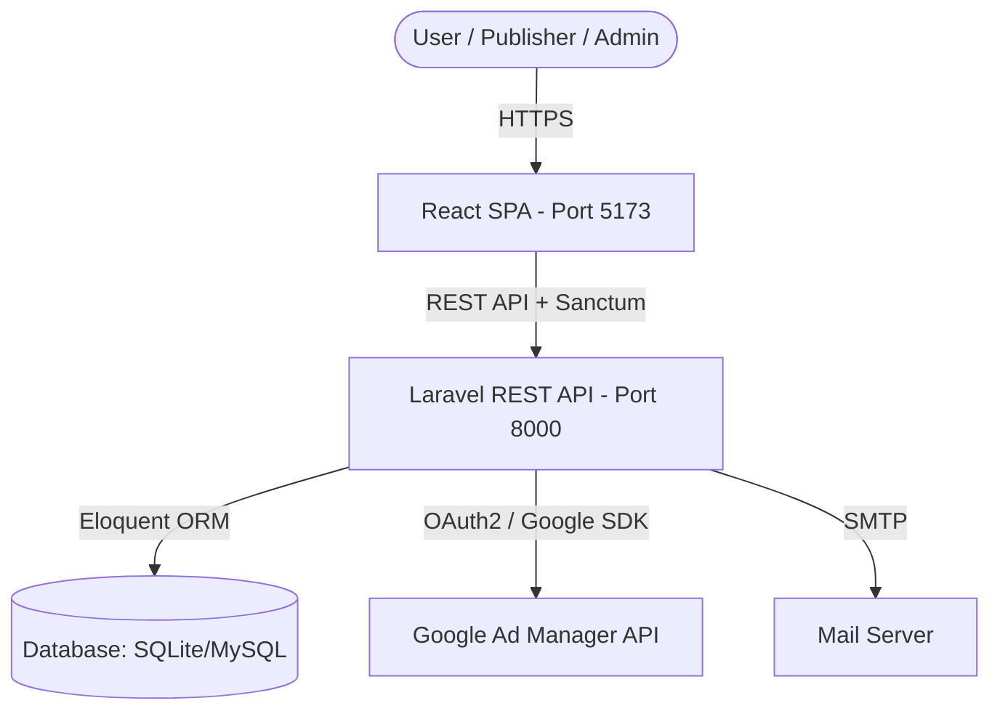
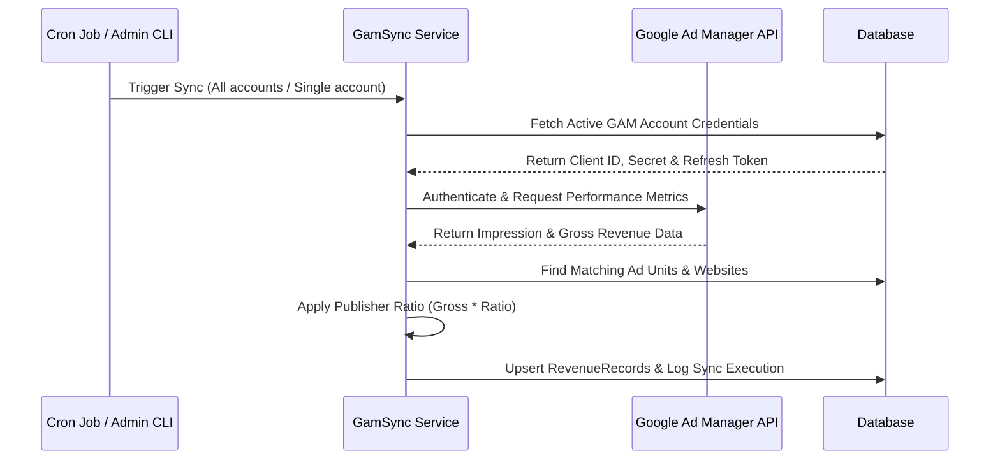
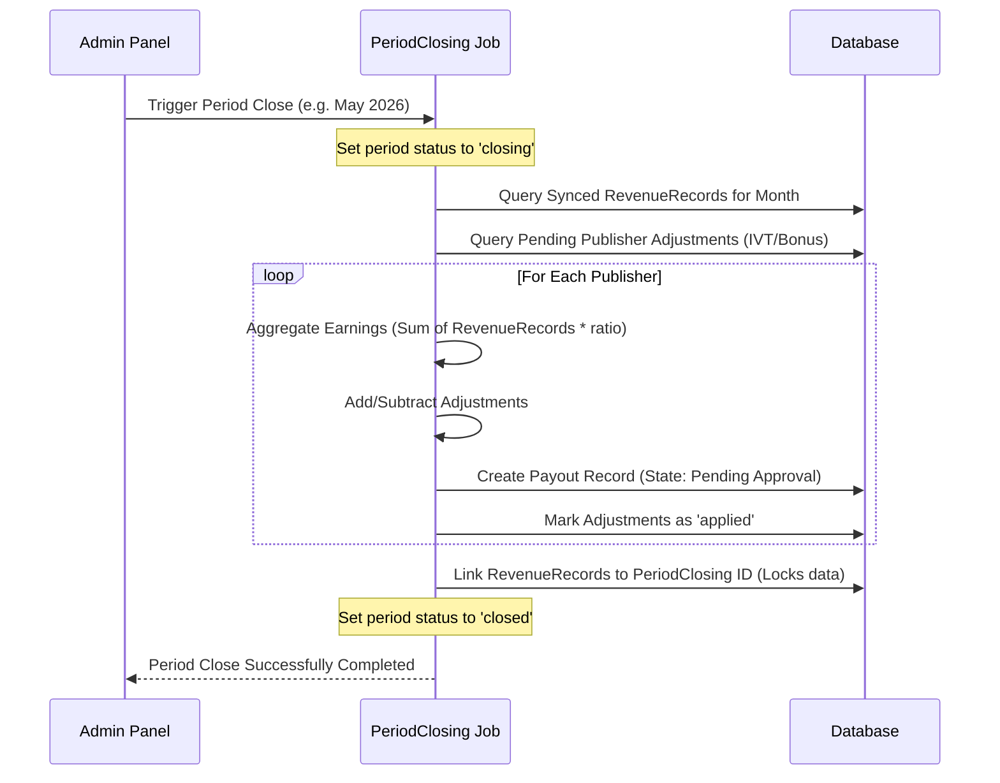

# System Architecture — BestRevenue Platform

This document describes the high-level architecture, design patterns, and data flow of the Publisher Revenue Sharing Platform (BestRevenue).

---

## 1. High-Level Architecture Overview

The system is split into a decoupled **Client-Server Architecture**:
- **Frontend SPA**: React (React 19, Vite 8, React Router v6, Tailwind CSS, TanStack React Query, Recharts).
- **Backend REST API**: Laravel 12 (Sanctum authentication, Spatie role/permission guards, PHP 8.2+).
- **External Integration**: Google Ad Manager (GAM) API.

---

## 2. Backend Architecture (Laravel 12 API)

The backend is built around standard MVC and Service Layer patterns. Key responsibilities include:

### A. Routing & Middlewares
- Public endpoints (`/api/v1/auth/*`, `/api/v1/translations/*`) are open or rate-limited.
- Authenticated endpoints use `auth:sanctum` middleware.
- Role-based access is protected by Spatie middleware:
  - `role:admin`: Restricts access to administrative endpoints (Publishers CRM, settings, synchronization control, manual adjustments, period closings, templates).
  - `role:publisher`: Restricts access to publisher dashboards, website registration, personal revenue charts, and payout accounts.

### B. Core Services
1. **Google Ad Manager Sync Service**
   - Connects to the Google Ads API using stored refresh tokens for multiple authenticated `GamAccount` entries.
   - Triggers sync jobs that retrieve network info and fetch daily/hourly metrics (impressions, unfilled impressions, clicks, gross revenue).
   - Computes base publisher earnings using active revenue share ratios.
2. **Period Closing Engine**
   - Processes the locking of revenue records for a complete calendar month.
   - Iterates through active publishers, aggregates revenue and applies active adjustments (Invalid Traffic or bonuses).
   - Generates static `Payout` records and sets database references on synced `RevenueRecord` tables, avoiding double-closing.
3. **Security Cast Attribute**
   - Uses Laravel's encryption engine to automatically encrypt publisher payment details (IBAN, PayPal, crypto keys) when saved and decrypt them upon query, preventing database leak visibility.

---

## 3. Frontend Architecture (React SPA)

The frontend is a single-page application focused on high-performance state rendering, dashboard analysis, and multi-language support.

### A. State Management & Data Fetching
- **Client State**: Standard React hooks and Context API for authentication state and local configurations.
- **Server State**: Managed by **TanStack React Query** v5. This provides automatic caching, background fetching, pagination state holding, and cache invalidation upon API updates (mutations).
- **HTTP Client**: Axios instance configured with interception hooks to automatically include Bearer tokens and handle `401 Unauthorized` logouts.

### B. Structure & Layouts
- **Layout Guards**:
  - `AdminLayout`: Renders side navigation specific to admins, protecting paths using admin-only auth context checks.
  - `PublisherLayout`: Renders side navigation tailored to publishers, hiding configuration panels and presenting dashboard widgets.
- **Localization (i18n)**: Renders translations via `react-i18next`. Dynamically downloads vocabulary maps from backend translation tables.

---

## 4. Key System Workflows

### A. GAM Synchronizing Sequence

### B. Month-End Period Closing Workflow

