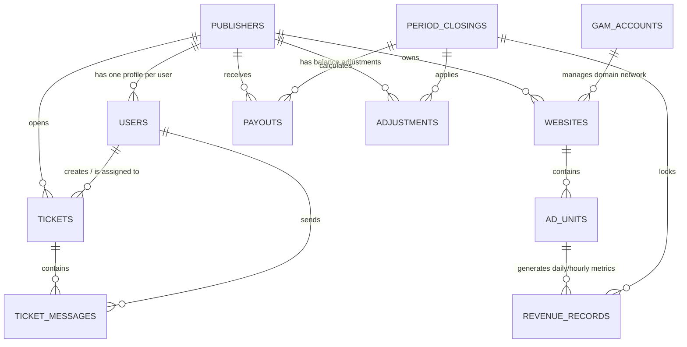

# Database Schema — BestRevenue Platform

This document details the database architecture of the Publisher Revenue Sharing Platform (BestRevenue), including database tables, columns, relations, indices, and constraints.

---

## 1. Entity Relationship Diagram (ERD)

---

## 2. Table Specifications

### A. `publishers`
Holds the profiles of publisher clients.
- `id` (UUID, Primary Key): Unique publisher identifier.
- `name` (varchar(200)): Company or contact name.
- `email` (varchar(255), Unique): Primary contact email.
- `default_ratio` (decimal(5,4), Default: 0.7000): Default revenue share percentage (e.g., 70%).
- `status` (enum('active', 'suspended', 'pending'), Default: 'active'): Account access status.
- `payment_info` (text/json, Nullable): Encrypted payment destination details (IBAN, PayPal email, crypto address).
- `notes` (text, Nullable): Internal administrative notes.
- `pending_balance_adjustment` (decimal(12,2), Default: 0.00): Accumulated adjustments awaiting next period closing.
- `phone`, `telegram`, `skype` (varchar(100), Nullable): Messenger contact details.
- `country` (varchar(100), Nullable): Country location.
- `reg_ip`, `last_ip` (varchar(45), Nullable): IP addresses for registrations and logging.
- `timestamps` (created_at, updated_at).

### B. `users`
Authenticated system users (Admins or Publisher contacts).
- `id` (UUID, Primary Key).
- `publisher_id` (UUID, Foreign Key, Nullable): References `publishers.id`. Null for administrator accounts.
- `name` (varchar(255)).
- `email` (varchar(255), Unique).
- `password` (varchar(255)).
- `role` (enum('admin', 'publisher'), Default: 'publisher'): Access tier control.
- `timestamps` (created_at, updated_at).

### C. `gam_accounts`
Stores Google OAuth2 details for synchronized Google Ad Manager networks.
- `id` (UUID, Primary Key).
- `network_name` (varchar(255)): Name of the GAM network.
- `network_code` (varchar(50), Unique): Numerical Google network code.
- `client_id` (varchar(255)): Google OAuth client ID.
- `client_secret` (varchar(255)): Google OAuth client secret.
- `refresh_token` (text): OAuth2 token used to issue new access tokens.
- `status` (enum('active', 'expired', 'error'), Default: 'active').
- `timestamps` (created_at, updated_at).

### D. `websites`
Monitored publisher domains mapping back to a GAM account.
- `id` (UUID, Primary Key).
- `publisher_id` (UUID, Foreign Key): References `publishers.id`.
- `gam_account_id` (UUID, Foreign Key): References `gam_accounts.id`.
- `domain` (varchar(255)): Domain URL (e.g. `example.com`).
- `ratio_override` (decimal(5,4), Nullable): Custom revenue share override specific to this site.
- `gam_network_code` (varchar(50)).
- `is_active` (boolean, Default: true).
- `timestamps` (created_at, updated_at).

### E. `ad_units`
Faceted ad placements defined under publisher websites.
- `id` (UUID, Primary Key).
- `website_id` (UUID, Foreign Key): References `websites.id`.
- `path` (varchar(255)): Full hierarchical GAM ad unit path.
- `name` (varchar(255)): Ad unit display name.
- `gam_ad_unit_id` (varchar(100), Unique): Unique code generated by Google.
- `ad_type` (varchar(50), Default: 'banner'): Placement type (e.g. banner, reward, interstitial, anchor, float_top, float_bottom, float_fullscreen).
- `ad_subtype` (varchar(50), Nullable): Specific type configuration (e.g. normal/repeated for rewards, top/bottom for anchors).
- `repeat_count` (integer, Nullable): Number of repetitions for repeated reward ads.
- `delay_between_ads` (integer, Nullable): Time in seconds between sequential ads.
- `timestamps` (created_at, updated_at).

### F. `revenue_records`
Synchronized metrics capturing traffic and earnings. Unique on `(ad_unit_id, date, hour, country)`.
- `id` (UUID, Primary Key).
- `ad_unit_id` (UUID, Foreign Key): References `ad_units.id`.
- `date` (date).
- `hour` (tinyint): Hour block (0 to 23).
- `country` (char(2), Default: '--'): ISO 3166-1 alpha-2 country code.
- `impressions` (bigint, Default: 0).
- `unfilled_impressions` (bigint, Default: 0).
- `active_view_eligible_impressions` (bigint, Default: 0): Impressions measurable by GAM Active View technology.
- `active_view_viewable_impressions` (bigint, Default: 0): Impressions confirmed viewable (≥50% visible for ≥1 second, IAB standard).
- `clicks` (integer, Default: 0).
- `ctr` (decimal(8,6), Default: 0.000000): Clicks divided by impressions.
- `gross_revenue` (decimal(14,6), Default: 0.000000): Raw earnings reported by GAM.
- `cpm` (decimal(10,4), Default: 0.0000): Gross cost per mille.
- `ratio_applied` (decimal(5,4), Default: 0.0000): The ratio used at sync time.
- `publisher_earnings` (decimal(14,6), Default: 0.000000): Net portion paid to publisher (`gross_revenue * ratio_applied`).
- `publisher_cpm` (decimal(10,4), Default: 0.0000): Net publisher CPM.
- `period_closing_id` (UUID, Foreign Key, Nullable): Reference lock to `period_closings.id`.
- `synced_at` (timestamp).

### G. `period_closings`
Locks a month of traffic, facilitating payout generation.
- `id` (UUID, Primary Key).
- `period_year` (smallint): Year of the closed period (e.g. `2026`).
- `period_month` (tinyint): Month of the closed period (e.g. `5` for May).
- `status` (enum('closing', 'closed'), Default: 'closing'): Controls lock states.
- `total_gross_revenue` (decimal(14,2), Default: 0.00).
- `total_publisher_earnings` (decimal(14,2), Default: 0.00).
- `total_impressions` (bigint, Default: 0).
- `notes` (text, Nullable).
- `closed_at` (timestamp, Nullable).
- `timestamps` (created_at, updated_at).

### H. `payouts`
Monthly payment vouchers generated from closed periods, or standalone manual payments.
- `id` (UUID, Primary Key).
- `publisher_id` (UUID, Foreign Key): References `publishers.id`.
- `period_closing_id` (UUID, Foreign Key, Nullable): References `period_closings.id`. Null for manual payments.
- `is_manual_payment` (boolean, Default: false): Indicates if this is a standalone manual payment.
- `manual_paid_by` (UUID, Foreign Key, Nullable): References `users.id` (Admin who initiated the manual payment).
- `period_year` (smallint, Nullable): Year of performance.
- `period_month` (tinyint, Nullable): Month of performance.
- `amount` (decimal(12,2), Default: 0.00): Base calculated publisher earnings.
- `adjustment` (decimal(12,2), Default: 0.00): Net sum of manual adjustments applied.
- `final_amount` (decimal(12,2), Default: 0.00): Final balance payout (`amount + adjustment`).
- `status` (enum('pending', 'approved', 'rejected', 'paid'), Default: 'pending').
- `admin_note` (text, Nullable).
- `payment_method` (varchar(100), Nullable): Captured payment type.
- `payment_account` (text, Nullable): Snapshot of the publisher's payment account details at the time the payout was created.
- `payment_reference` (varchar(255), Nullable): External Transaction ID.
- `approved_by` (UUID, Foreign Key, Nullable): References `users.id`.
- `approved_at` (timestamp, Nullable): Time when payout was approved.
- `paid_at` (timestamp, Nullable): Time when payout was marked paid.
- `idempotency_key` (varchar(64), Unique, Nullable): Key to prevent double submission.
- `timestamps` (created_at, updated_at).

### I. `adjustments`
Individual credits or debits pending application at period close.
- `id` (UUID, Primary Key).
- `publisher_id` (UUID, Foreign Key): References `publishers.id`.
- `amount` (decimal(10,2)): Positive for bonuses, negative for IVT deductions.
- `notes` (text): Explanation for transaction adjustment.
- `status` (enum('pending', 'applied'), Default: 'pending').
- `period_closing_id` (UUID, Foreign Key, Nullable): Associated closing reference when applied.
- `created_by` (UUID, Foreign Key, Nullable): References `users.id`.
- `timestamps` (created_at, updated_at).

### J. `ratio_history`
Maintains trail of publisher default revenue share percentage changes.
- `id` (bigint, Primary Key, Auto Increment).
- `publisher_id` (UUID, Foreign Key): References `publishers.id`.
- `old_ratio` (decimal(5,4)).
- `new_ratio` (decimal(5,4), Nullable).
- `changed_by` (UUID, Foreign Key): References `users.id`.
- `timestamps` (created_at, updated_at).

### K. `settings`
Stores dynamic global configurations for the platform.
- `key` (varchar(100), Primary Key): Unique configuration identifier.
- `value` (text, Nullable): Configuration value (can hold string, integer, boolean, or JSON array/object payloads).
- `group` (varchar(50), Default: 'general'): Settings group for categorization (e.g. `general`, `display`, `seo`, `registration`, `payment`, `google`).
- `label` (varchar(200)): Display label for administrators.
- `type` (varchar(20), Default: 'string'): Data type validation guard (e.g. `string`, `integer`, `boolean`, `json`).
- `updated_at` (timestamp, Nullable): Time when configuration was last updated.

#### Seeded Keys & New Configurations (Sprint 11/12 Settings Upgrade):
* **SEO Settings (`group: 'seo'`)**:
  * `meta_title`: Dynamic HTML document title prefix.
  * `meta_description`: HTML head meta tag description for public authentication pages.
  * `meta_keywords`: HTML head meta tag keywords list.
* **Branding Settings (`group: 'display'`)**:
  * `site_description`: Text description of the platform.
  * `site_logo`: Path/URL to the uploaded platform logo image (dynamic header/sidebar renders).
  * `site_favicon`: Path/URL to the uploaded platform browser favicon.
  * `og_image`: Open Graph image URL for social media share previews.
* **Registration Controls (`group: 'registration'`)**:
  * `registration_status`: Controls self-registration access (`'open'` or `'closed'`).
* **Payment Configuration (`group: 'payment'`)**:
  * `payment_methods`: JSON array of structured payment methods, each containing `name`, `minimum` payout threshold, and `guidance` instructions.
* **GAM Settings (`group: 'gam'`)**:
  * `ad_type_preselected_sizes`: JSON mapping of preselected sizes for each ad type (Banner, Reward, Interstitial, Anchor, etc.) dynamically applied on ad unit generation.

---

## 3. Database Indexes & Integrity Constraints

### A. Optimization Indices
To maintain performance across millions of record metrics, the following indices are configured:
1. **`revenue_records`**:
   - Unique Index: `revenue_unique` on `(ad_unit_id, date, hour, country)`.
   - Index: `(date, country)` for optimized regional dashboards.
   - Composite Index: `revenue_records_closing_date_index` on `(period_closing_id, date)` to speed up scanning during period closing processes.
2. **`payouts`**:
   - Unique Index: `(publisher_id, period_closing_id)`.
   - Unique Index: `payouts_idempotency_key_unique` on `(idempotency_key)` to secure API calls.
   - Index: `status` for queueing processing tables.
3. **`adjustments`**:
   - Indexes on `publisher_id` and `status` to compute real-time pending balance balances quickly.

### B. Database Integrity Constraints (MySQL check constraints)
Raw constraints are configured on the database layer to enforce positive numerical states (SQLite tests execute driver-conditionally):
- `chk_payouts_final_amount`: `final_amount >= 0` on `payouts` table.
- `chk_payouts_amount`: `amount >= 0` on `payouts` table.
- `chk_adjustments_amount`: `amount != 0` on `adjustments` table (prevents zero-value adjustment records).

---

## 4. Ticketing Tables Specification

### L. `tickets`
Holds support tickets raised by publishers.
- `id` (uuid, Primary Key): Unique ticket identifier.
- `publisher_id` (uuid, Foreign Key): References `publishers.id` (cascade on delete).
- `user_id` (uuid, Foreign Key): References `users.id` (creator - cascade on delete).
- `assigned_to` (uuid, Foreign Key, Nullable): References `users.id` (admin assignee - set null on delete).
- `subject` (varchar(255)): Summary of the issue.
- `category` (enum('billing', 'technical', 'gam', 'other')): Issue category.
- `priority` (enum('low', 'medium', 'high', 'urgent')): Priority level.
- `status` (enum('open', 'in_progress', 'resolved', 'closed'), Default: 'open'): Ticket status.
- `timestamps` (created_at, updated_at).

### M. `ticket_messages`
Stores the messages/replies under a support ticket thread.
- `id` (uuid, Primary Key): Unique message identifier.
- `ticket_id` (uuid, Foreign Key): References `tickets.id` (cascade on delete).
- `user_id` (uuid, Foreign Key): References `users.id` (sender - cascade on delete).
- `message` (text): Content of the reply message.
- `is_admin_reply` (boolean): Flag identifying if the sender is an administrator.
- `timestamps` (created_at, updated_at).

### N. `pages`
Stores dynamic custom pages managed by administrators (e.g. Privacy Policy, Terms of Service).
- `id` (UUID, Primary Key): Unique page identifier.
- `title` (varchar(255)): Page title (e.g. "Privacy Policy").
- `slug` (varchar(255), Unique): URL path slug (e.g. "privacy-policy").
- `content` (longText): Rich-text HTML content of the page.
- `show_in_public_footer` (boolean, Default: false): If true, displays in public page footers (Landing & Support).
- `show_in_publisher_footer` (boolean, Default: false): If true, displays in publisher portal dashboard footer.
- `show_in_landing_menu` (boolean, Default: false): If true, displays in landing page header navigation menu.
- `is_active` (boolean, Default: true): Control publishing status.
- `timestamps` (created_at, updated_at).

